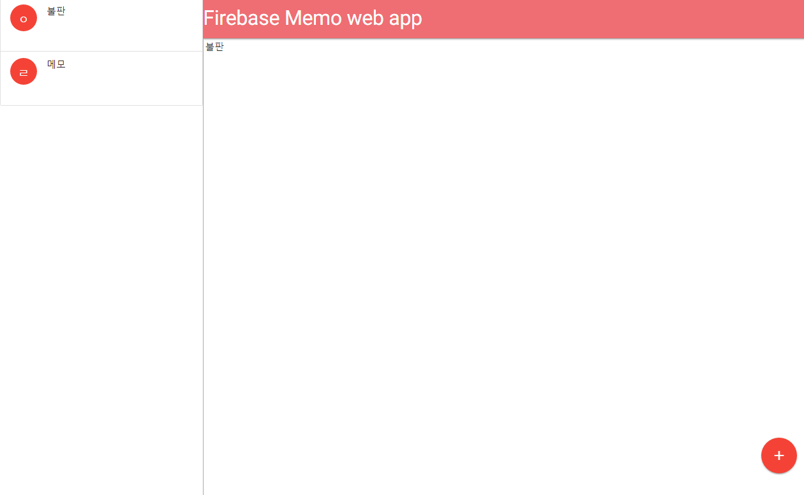

인프런의 무료 강의를 보고 따라해 보았다.

> [강의링크](https://www.inflearn.com/course/%ED%8C%8C%EC%9D%B4%EC%96%B4%EB%B2%A0%EC%9D%B4%EC%8A%A4-%EA%B0%95%EC%A2%8C-%EC%9B%B9-%EC%96%B4%ED%94%8C%EB%A6%AC%EC%BC%80%EC%9D%B4%EC%85%98/)

강의는 1시간20분짜리이고, 실습까지 포함하여 2시간 정도 걸렸다.

firebase가 실시간 db만 제공하는 것이 아니라 정적 웹 페이지 호스팅도 제공하고 있었다.
사용방법도 쉽고 여러 언어의 sdk가 제공되고 있어, 간단한 웹페이지를 만들때 활용할 수 있을 것 같다.

- firebase-tools설치
- html 코드 작성
- 배포

> [소스코드](https://github.com/camon85/firebase-memo-web-app)
 
> [결과 웹 페이지](https://api-6590514862941279208-75005.firebaseapp.com/)

---

---
