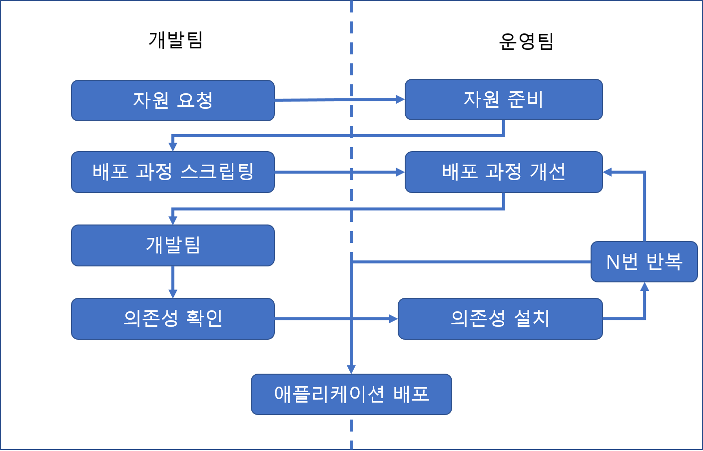
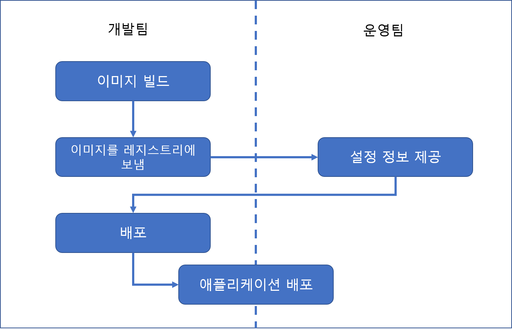
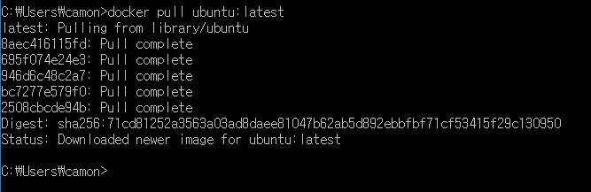
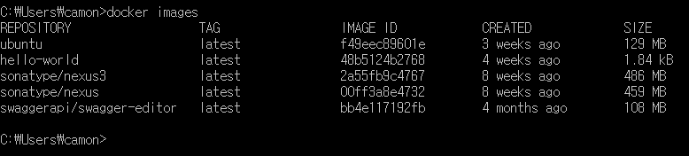
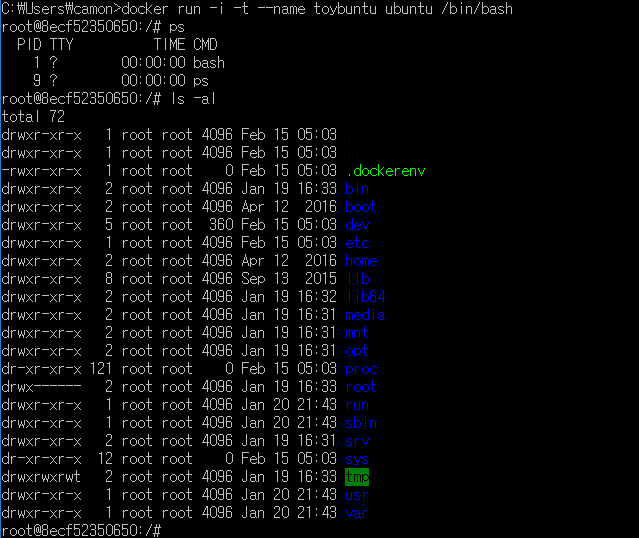
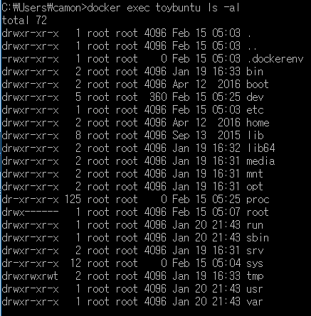

# 도커란?
도커는 단순한 가상 머신을 넘어서 어느 플랫폼에서나 재현 가능한 어플리케이션 컨테이너를 만들어주는 걸 목표로 합니다. 
가상 머신이라고 하기에는 격리된 환경을 만들어주는 도구라고 하는 게 맞을 지도 모릅니다.

# 전통적인 배포 워크플로우
1. 애플리케이션 개발자가 운영 엔지니어에게 자원을 요청한다.
2. 자원이 준비되고 개발자에게 인도된다.
3. 개발자들은 배포 과정을 스크립트와 도구로 만들거나 다듬는다.
4. 운영 엔지니어들과 개발자들이 배포 과정을 반복적으로 개선한다.
5. 개발자에 의해 추가로 필요한 의존성이 확인된다.
6. 운영 엔지니어들이 추가적인 요구 사항을 설치하기 위해 작업한다.
7. 5와 6을 필요한 만큼 반복한다.
8. 애플리케이션을 배포한다.

* 클라우드 도입으로 커뮤니케이션 비용이 많이 줄어들긴 했지만 여전히 간단한 작업은 아니다.
개발팀이 나중에 할 수 있는 개선 작업도 제한된다. 

# 도커 배포 워크플로우
1. 개발자들은 도커 이미지를 빌드하여 레지스트리에 보낸다.
2. 운영 엔지니어들은 컨테이너에 세부 설정을 제공하고 자원을 배분한다.
3. 개발자들이 배포를 시작한다.

# stateless한 애플리케이션에 적합하다.
RDBMS나 파일 저장소 형태로 사용하는 것은 불가능하지 않으나 도커의 철학과 맞지 않는다.
컨테이너의 재사용성을 그만큼 제한하게 되며, 설정 데이터의 수정 없이 다른 환경에 배포하는 것을 어렵게 만들수도 있다.
api서버, 크론 작업 등 상태를 저장하지 않는 애플리케이션에 적합하다.

# 빌드
애플리케이션 빌드는 많은 조직에서 소수의 사람만이 방법을 아는 마술같은 작업이다.
도커는 모든 문제점을 해결해 주지는 못하지만, 표준화된 도구의 설정과 빌드를 위한 도구들을 제공한다.
이것들은 구성원들에게 애플리케이션의 빌드 방법을 익히고 새로운 빌드를 만들어 보는 것을 쉽게 할 수 있도록 도와준다.

* Dockerfile은 단순히 어플리케이션 설치를 스크립트로 만들어주는 게 아니라, 배포환경 구축까지 한꺼번에 해주는 역할을 합니다.

# 도커 설치
[공식 홈페이지 참조](https://www.docker.com/products/overview)

# 도커 써보기

### ubuntu latest버전의 도커 이미지 다운받기
* docker pull ubuntu:latest

### 도커 이미지 보기
* docker images

### 도커 컨테이너 실행
* docker run -i -t --name toybuntu ubuntu /bin/bash

-i (interative), -t (pseude-tty) 실행된 bash 쉘에 입력 및 출력 가능.
 
--name 옵션으로 컨테이너에 이름을 지정할 수 있다. 이름을 지정하지 않으면 랜던한 이름을 생성해준다.

exit로 bash쉘에서 빠져나오면 우분투 이미지에서 bash 실행 파일을 실행 했기 때문에 컨테이너가 stop 된다.

### 실행중인 컨테이너 보기
* docker ps 

### 실행종료된 컨테이너 포함하여 보기
* docker ps -a 

### 컨테이너 실행
* docker start toybuntu

### 컨테이너 접속
* docker attach toybuntu

엔터를 한번 더 쳐주면 컨테이너에 접속된다.
이때도 bash 쉘로 접속되기 때문에 exit로 빠져나오면 컨테이너가 종료된다.
Ctrl+P , Ctrl+Q를 눌러서 빠져나오면 컨테이너가 종료되지 않는다.

### 컨테이너 외부에서 명령어 실행
* docker exec toybuntu ls -al

... 작성중 ...
실전 사용방법 작성해야지.
os올리고 자바 설치하고 스프링부트로 작성된 jar실행 정도면 되려나

--------- 
장점: windows, ubuntu linux, redhat linux 등 호스트 os의 os에 영향을 받지 않는다.
개발자 PC부터 라이브까지 100% 동일한 실행환경을 유지하며 배포할 수 있다.
시스템의 변경 내역을 커밋하여 소스코드처럼 이력관리가 가능하다.

커뮤니케이션 비용.
쉽게 쓰고 버릴 수 있다. 특정 애플리케이션 구축으로 만들어진 환경은 애플리케이션 제거와 함께 실행 환경도 같이 폐기할 수 있다.

--------------
이런 내용은 일단 다 뺴버릴까

docker create와 docker run은 둘다 초기 컨테이너 셋업에 관한 옵션들을 모두 포함하고 있다.

docker diff
