* 도커를 이용해서 간단하게 배포 서버를 구성해보자.

# 설치

```sh
# 도커 이미지를 다운받는다.
$ docker pull jenkins

# jenkins-camon이라는 이름의 컨테이너를 생성하고 호스트의 7777 포트로 구동한다.
# 호스트의 /Users/camon/dev/jenkins_home 에 컨테이너의 /var/jenkins_home 폴더를 마운트 시킨다.
$ docker run --name jenkins-camon -p 7777:8080 -p 50000:50000 -v /Users/camon/dev/jenkins_home:/var/jenkins_home jenkins
```


아래와 같은 메시지가 나오면 웹브라우저를 열고 [젠킨스](http://localhost:7777)에 접속한 뒤,
5178313c2dc74f58923b2854c8d11fae 부분의 비밀번호를 복사 & 붙여넣기 해주자.
```sh
*************************************************************
*************************************************************
*************************************************************

Jenkins initial setup is required. An admin user has been created and a password generated.
Please use the following password to proceed to installation:

5178313c2dc74f58923b2854c8d11fae

This may also be found at: /var/jenkins_home/secrets/initialAdminPassword

*************************************************************
*************************************************************
*************************************************************
```

그러면 플러그인 설치화면이 나오는데, 설치가 끝나면 어드민 설정까지 해주면 준비는 끝이다.

아래와 같은 화면을 볼 수 있다.

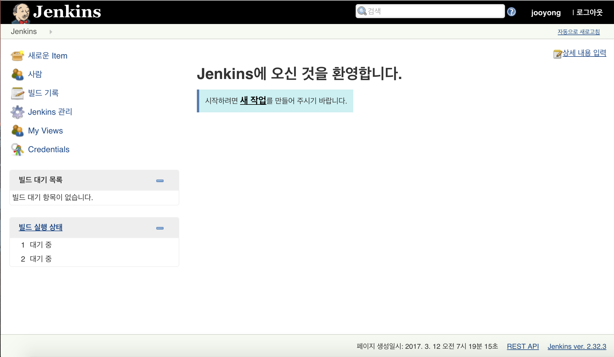

# 설정
추천 플러그인을 모두 설치했다면 gradle과 git 플러그인이 이미 설치되어 있을 것이다.
만약 직접 설치하고 싶으면 *Jenkins관리* - *플러그인 관리*로 메뉴로 가면 된다.

gradle 플러그인은 설치되었지만 gralde은 설치한 것은 아니기 때문에 다음과 같은 설정이 필요하다.

- *Jenkins관리* - *Global Tool Configuration* 메뉴에서 gradle부분으로 간다.

- name을 적당히 입력 

- 버전을 선택

- 하단 save버튼을 누른다.


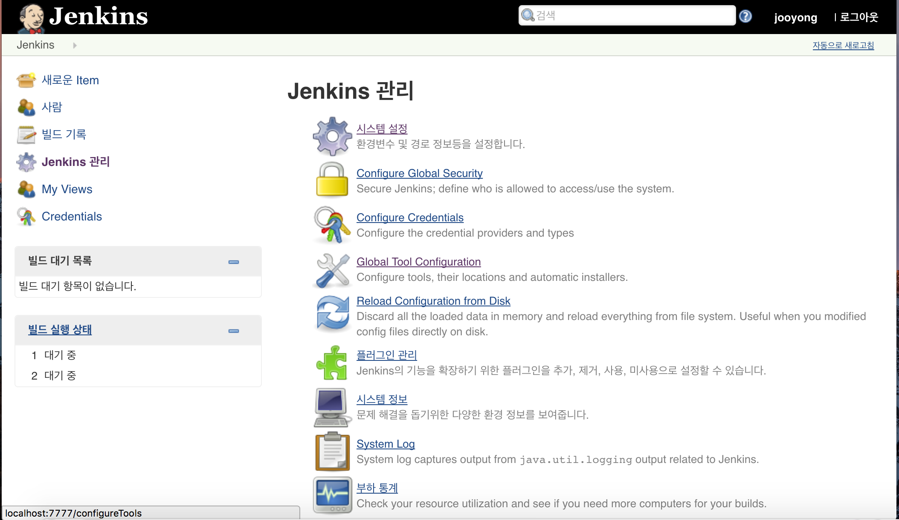
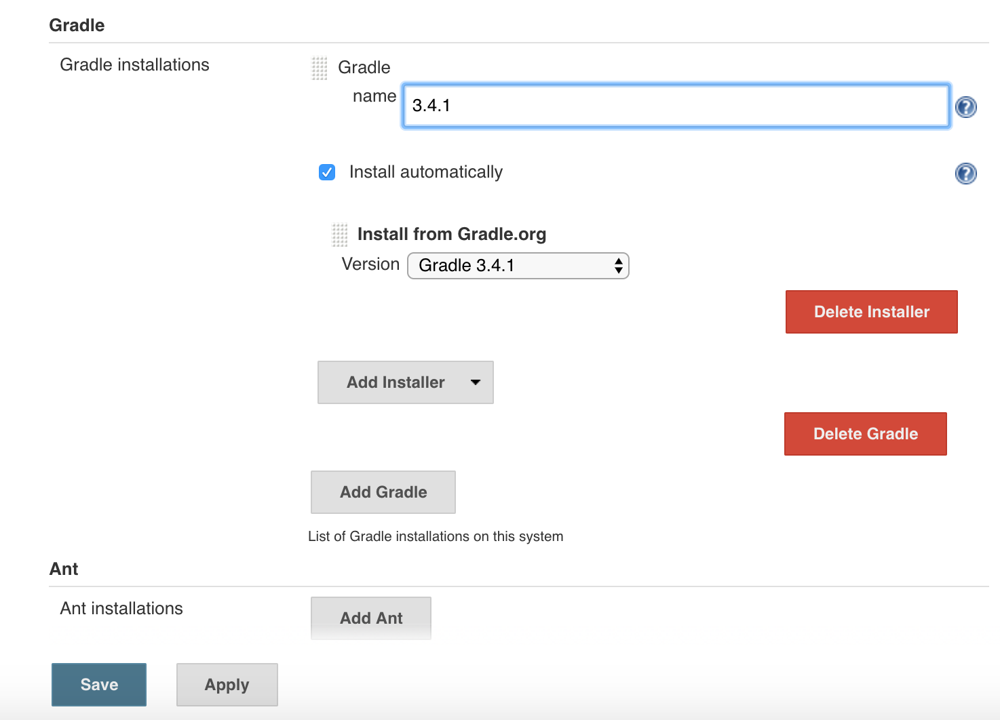


# 배포 설정
설정은 모두 끝났고, 미리 준비된 spring boot 프로젝트를 실제로 배포 해보겠다.
메인화면으로 돌아온다.
- 새로운 Item메뉴

- 작업의 이름을 적당히 입력한다.

- Freestyle project 선택 후 ok

- 소스코드 관리탭에 url을 입력해준다. Repository URL : https://github.com/camon85/docker-spring-hello.git

- Build탭에 Add build step - Invoke Gradle script

- Gradle version에 아까 설정했던 3.4.1을 선택

- Tasks 에 bootRun

- 하단 Save버튼을 누르면 끝

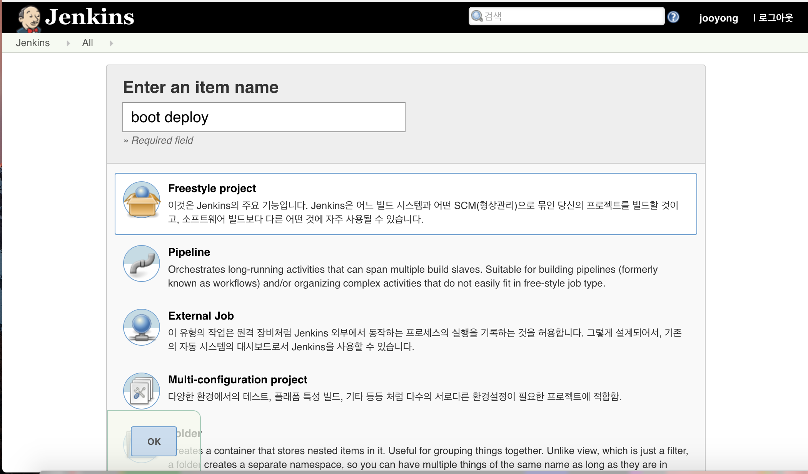
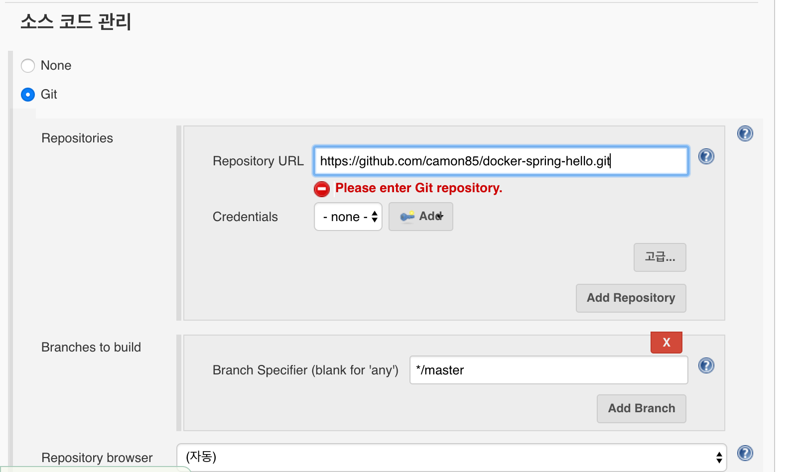
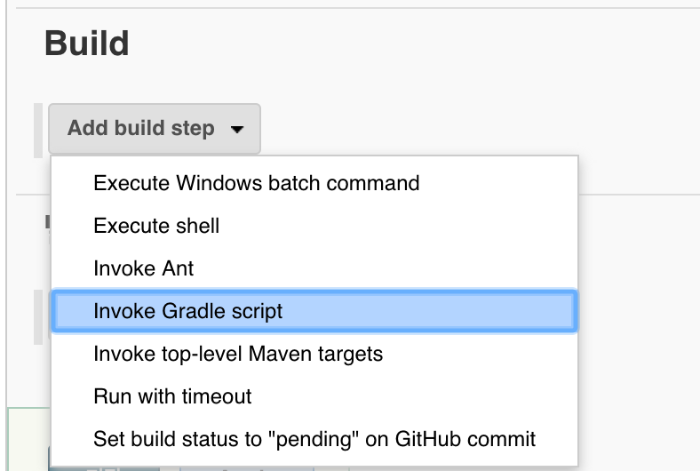
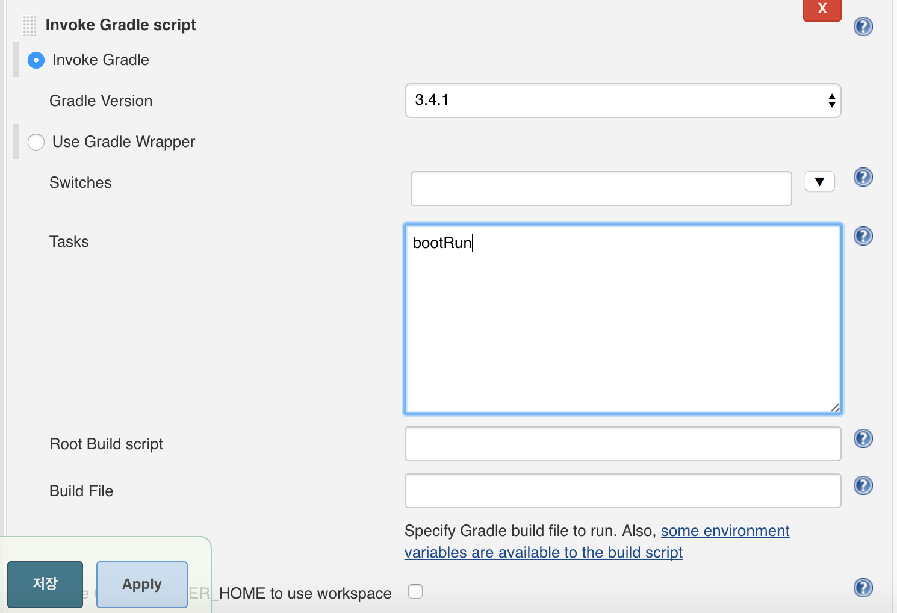

# 배포
다시 메인화면으로 돌아온다.
boot deploy 아이템이 생성된 것을 볼 수 있을 것이다.

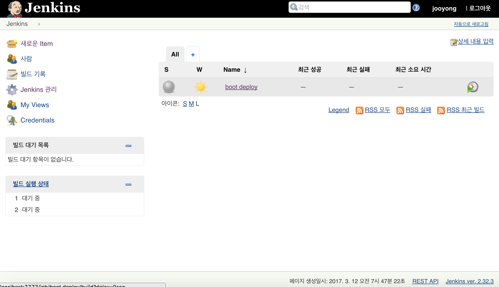

느낌적인 느낌으로 우측에 있는 녹색 화살표 버튼을 눌러보자.

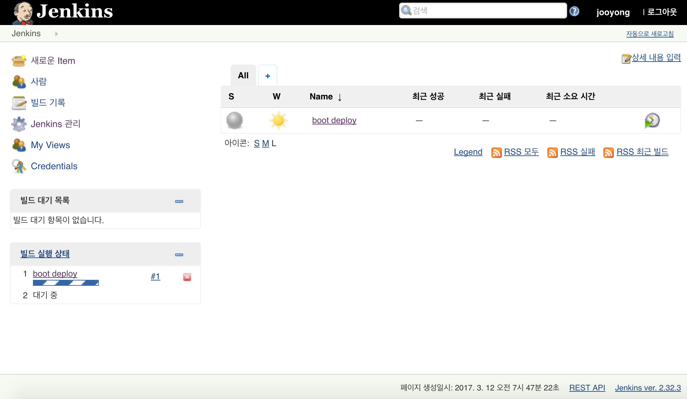

좌측 하단에 빌드 실행 상태 바가 움직이는 것을 볼 수 있다.

#1 버튼을 눌러 들어간 화면에서 Console output 버튼을 누르면

젠킨스가 어떤 일을 하고 있는지 볼 수 있다.


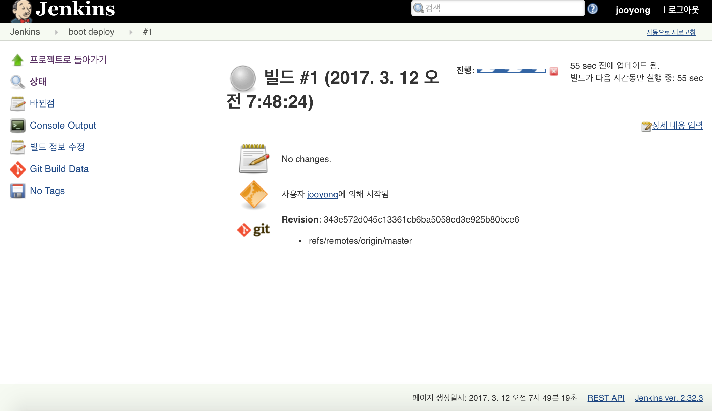
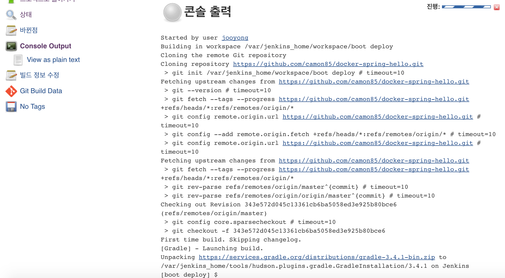


두가지 문제점이 있다.

> 완료되지 않고 무한히 돌고 있다.

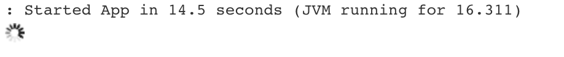


> 도커 컨테이너 내부에서 8888 포트로 실행 중이다. 호스트에서 실행된 것이 아니다.

이게 아닌데;

호스트로 배포하려면 어떻게 하지? ㅎㅎㅎㅎㅎㅎㅎㅎㅎㅎㅎㅎ;


일단 밥먹으러....