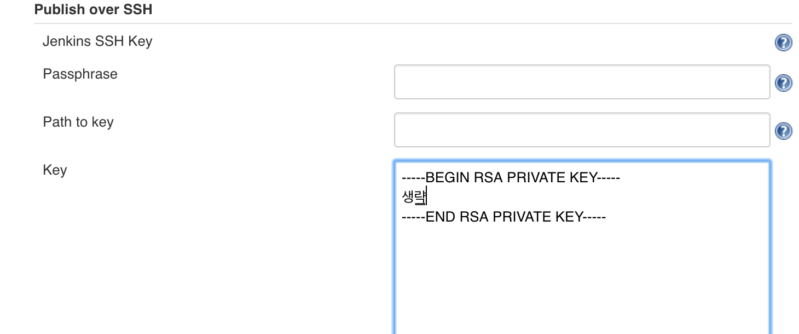
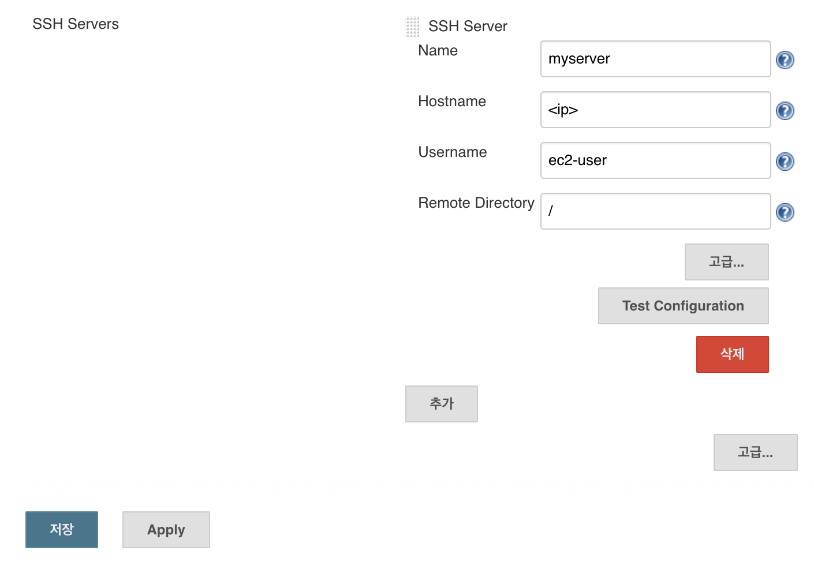
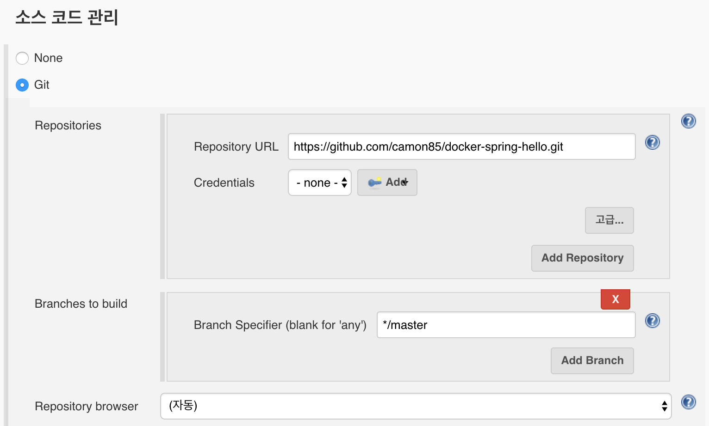
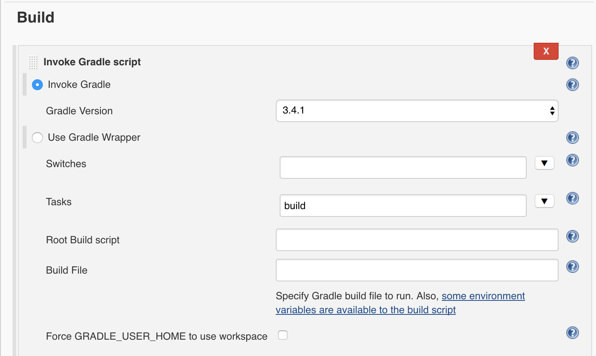
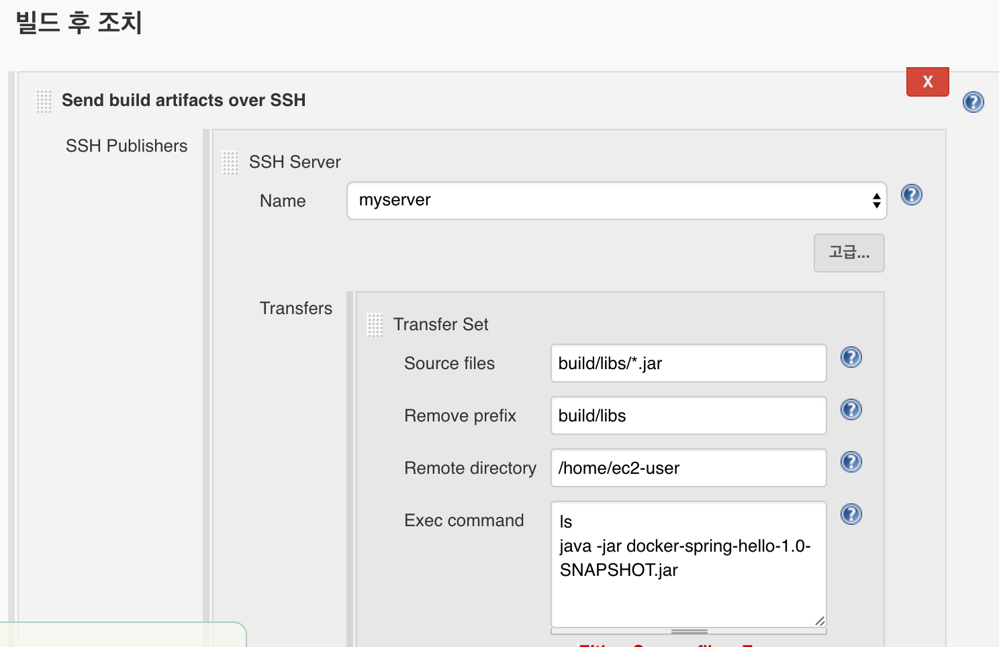
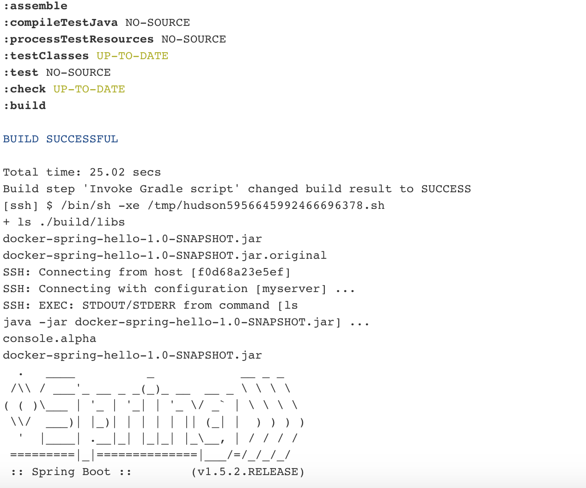

* 사실 1부에서는 배포라기보다 단순히 spring boot app 실행이었다.
2부에서는 원격 서버로 배포를 해보자.

Publish over ssh plugin 설치는 했다고 가정한다.

# ssh 설정

- Jenkins관리 - 시스템 설정 - Publish over SSH

- ssh key로 접속한다면 Passphrase 항목은 비워도 된다. id/password방식이라면 비밀번호를 넣으면 될 것 같다.

- Key 항목에 private key입력

- SSH Servers에 추가 버튼을 눌러서 원격 서버의 정보를 입력한다.

- 저장

# Job설정
- 1부에서와 동일하게 새로운 Item, Freestyle project로 만들어 보자.

- 소스코드 관리에 git경로를 적어준다.

- Build 항목에 Tasks에는 build만 입력하자. jar 파일을 만들어 준다.

- 빌드 후 조치 항목에는 좀 전에 설정했던 myserver를 골라준다.

- Transfers는 아래 스크린샷을 보면 쉽게 이해 될 것이다.

- Job을 실행하면 git checkout -> jar packaging -> jar파일 복사 -> jar실행 되는 과정을 볼 수 있다.

# 문제점
재배포를 시도하면 기존 프로세스가 종료되지 않아 포트 충돌이 날 것이다.

여전히 job이 완료되지 않는 문제가 존재한다.

이건 또 다음 기회에...